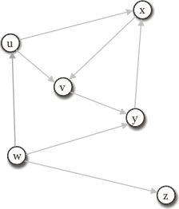
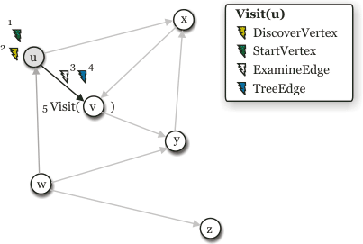
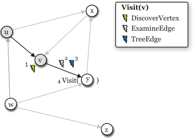
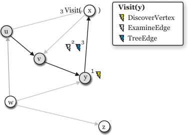
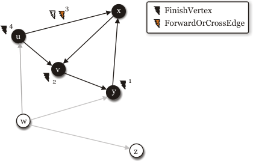
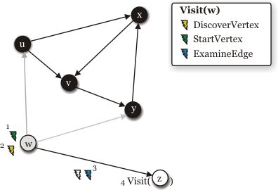
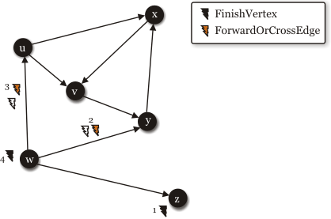

#### Depth First Search Example

Let us illustrate how algorithms work by applying a [depth-first-search](http://en.wikipedia.org/wiki/Depth-first_search) algorithm on a simple graph. 

When possible, a depth-first traversal chooses a vertex adjacent to the current vertex to visit next. If all adjacent vertices have already been discovered, or there are no adjacent vertices, then the algorithm backtracks to the last vertex that had undiscovered neighbors. Once all reachable vertices have been visited, the algorithm selects from any remaining undiscovered vertices and continues the traversal. The algorithm finishes when all vertices have been visited. 
Depth-first search is useful for categorizing edges in a graph, and for imposing an ordering on the vertices. 

The depth-first-search algorithm is part of a family of graph algorithms that colorize vertices. By convention such algorithms always use the same 3 color markers:
* {{White}}: vertex not yet discovered 
* {{Gray}}: vertex discovered, and sub-tree being explored 
* {{Black}}: vertex discovered and sub-tree traversal finished 

_tip:_ In QuickGraph, algorithms that colorize vertices implement the {{IVertexColorizerAlgorithm}} interface.

The depth first search is implemented by the {{DepthFirstSearchAlgorithm}} class. This class exposes a number of events (not all are detailed here) that are used by observers:

* [InitializeVertex](InitializeVertex), invoked on each vertex before starting the computation,
* [DiscoverVertex](DiscoverVertex), invoked when a vertex is encountered for the first time, 
* [ExamineEdge](ExamineEdge), invoked on every out-edge of each vertex after it is discovered, 
* [TreeEdge](TreeEdge), invoked on each edge as it becomes a member of the edges that form the search tree, 
* [FinishVertex](FinishVertex), invoked on a vertex after all of its out edges have been added to the search tree and all of the adjacent vertices have been discovered (but before their out edges have been examined). 

The application of the depth first search to a simple graph is detailed in the figures below. The code to achieve this looks (more or less) as follows:

{{
// A graph that implements the IVertexListGraph interface
var g = new AdjacencyGraph<Vertex,Edge>();
...
// create algorithm
var dfs = new DepthFirstSearchAlgorithm<Vertex,Edge>(g);
//do the search
dfs.Compute();
}}

* {{InitializeVertex}} event is triggered on each vertex, 

* Visiting {{u}} vertex yields to the following event triggers: 
	* {{StartVertex(u)}}, 
	* {{DiscoverVertex(v)}}, 
	* {{ExamineEdge(u,v)}}, 
	* {{TreeEdge(u,v)}}
 
* Visiting {{v}} vertex, 

* Visiting {{y}} vertex, 

* Visiting {{x}} vertex. The edge {{(x,v)}} is a [back edge](back-edge), i.e. it points to a gray vertex. Since there are no more out-edges to explorer, the vertex is finished and blacked.

* Finishing u vertex.  The edge {{(u,x)}} is a cross-edge because it points to a black vertex (x).

* Since {{w}} was not reachable from {{u}}, the search is restarted. 

* Finishing graph 

 The figures above show when the events are called. The events are used by the observers to record data. For example, using the [TreeEdge](TreeEdge) event one can extract a tree out of the graph. The tree is recorded under the form of a dictionary associating each vertex with it’s predecessor edge:
{{
dfs.TreeEdge += new EdgeEventArgs<Vertex,Edge>(this.treeEdge);

Dictionary<Vertex,Edge> vertexPredecessors;
void treeEdge(Object sender, EdgeEventArgs<Vertex,Edge> e)
{
    vertexPredecessors.Add(e.Target, e);    
}
}}
In fact, this is what the {{VertexPredecessorRecorderObserver}} does by building  one a table of vertex parents.
{{
var observer =  new VertexPredecessorRecorderObserver<Vertex,Edge>();
using(ObserverScope.Create(dfs, observer)) // attach, detach to dfs events
    dfs.Compute();

// oberser.Predecessors is a IDictionary<Vertex,Edge> that link vertices
// to their parent edges
…
}}